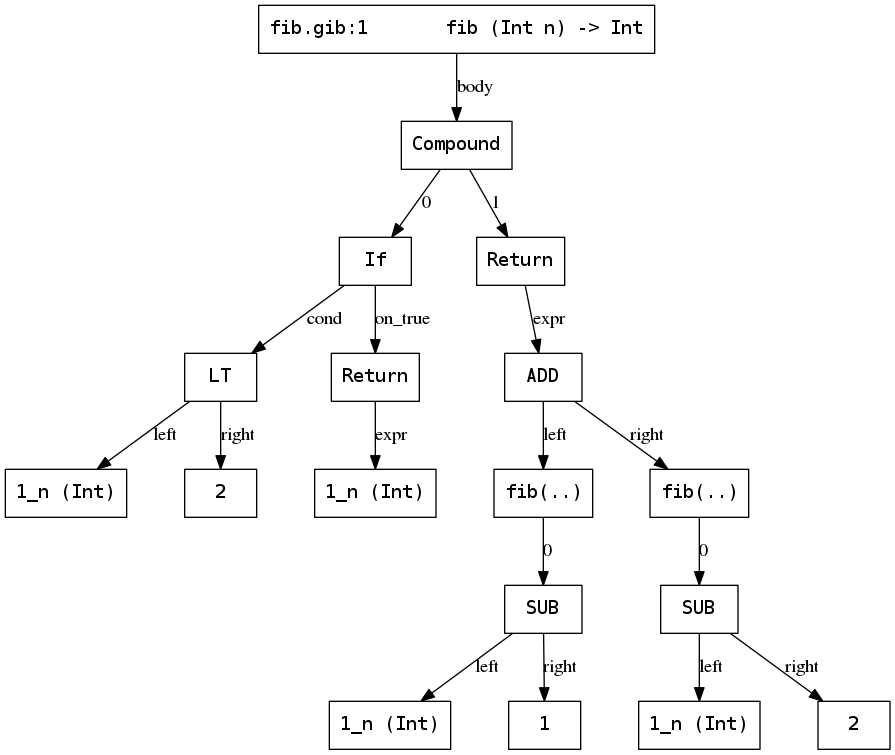

# Questions

This document records questions and answers occurring throughout the course.

- [How should the resulting AST look like?](#how-should-the-resulting-ast-look-like)
- [How to parse only expressions / statements for unit tests?](#how-to-parse-only-expressions--statements-for-unit-tests)
- [I cannot get unary minus / binary minus to work.](#i-cannot-get-unary-minus--binary-minus-to-work)
- [How to store literals / array size?](#how-to-store-literals--array-size)

- - - - - - - - - - - - - - - - - - - - - - - - - - - - - - - - - - - - - - - -

## How should the resulting AST look like?

> \<QQ\>: how should the resulting AST look like, can you give us an example pic?
> Should it only consists of one assignment?
> Else the order of the tasks makes no sense.

The resulting AST is a representation of the corresponding input program.
The exact design of your AST data structure is up to you.
Depending on the design decisions you make, some things will be harder to implement, others easier.

You should integrate a way to visualise this data structure as early as possible, as it eases the process of debugging.
And because it looks nice.

As an example, take the following function, being part of a larger input program:

```c
int fib(int n)
{
	if (n < 2) return n;
	return fib(n - 1) + fib(n - 2);
}
```

The visualisation of an AST representing this function could look like this:



*Variable names are prefixed with an id followed by an underscore.*

Every statement, expression, literal, operator, etc; is modelled here.
This would be a subtree of the AST representing the whole input program.

- - - - - - - - - - - - - - - - - - - - - - - - - - - - - - - - - - - - - - - -

## How to parse only expressions / statements for unit tests?

Normally the top-rule of the parser accepts only a whole program.
For debugging and testing purposes it can be handy to provide methods which can parse a single expression, or a single statement (or similar).

This can be achieved by using a dedicated token in the top-level rule to determine which rule to invoke next.
The corresponding token needs to be passed to the parser prior feeding it with the actual input.

More details can be found in the Bison manual:
[Multiple start-symbols](https://www.gnu.org/software/bison/manual/html_node/Multiple-start_002dsymbols.html)

- - - - - - - - - - - - - - - - - - - - - - - - - - - - - - - - - - - - - - - -

## I cannot get unary minus / binary minus to work.

> \<SomeName\>: Anyone else have the problem that these all work:
> 5+3; 4*5; 5/5; 5<6; 6>5; 5<=5; 11>=10; true&&true; false||false; 1==1; 2!=1;\
> \<SomeName\>: BUT this does not 5-3;

If you are using the provided code-base, have a look at commit [7d27f6c5](https://github.com/W4RH4WK/mCc/commit/7d27f6c58ee543d7e5f2ca63ea704d5cd9eccbe8).
Initially a minus just before an int / float literal was consumed by the lexer as part of the literal.
This leads to the problem that a unary / binary minus is not communicated to the parser explicitly.

The referenced commit fixes this behaviour, but also drops support for unary minus in the provided code-base.

*Note:* It is highly recommended to implement / enable some form of tracing output to catch similar errors.
Often the behaviour of the parser becomes obvious when inspecting the token stream or the list of which rules have been tried by the parser.

- - - - - - - - - - - - - - - - - - - - - - - - - - - - - - - - - - - - - - - -

## How to store literals / array size?

I have added a section [Size Limitations](../mC_specification.md#size-limitations) to the mC specification.
Basically, you can assume `long` / `double` suffices for literals and array size.
We have other things to worry about in constructing a compiler than these details.
